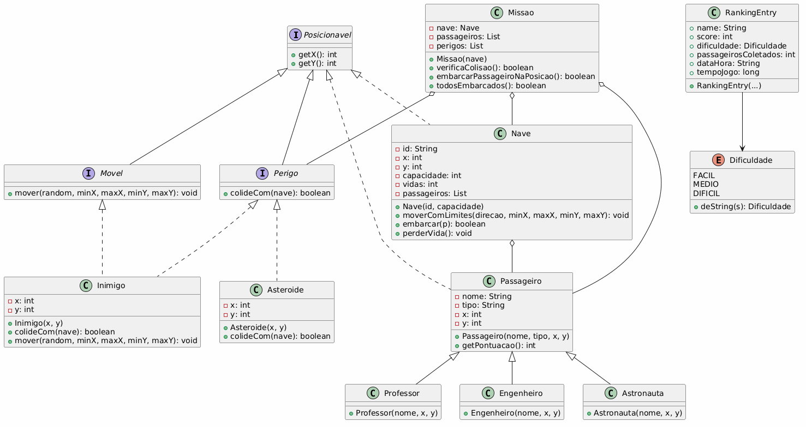
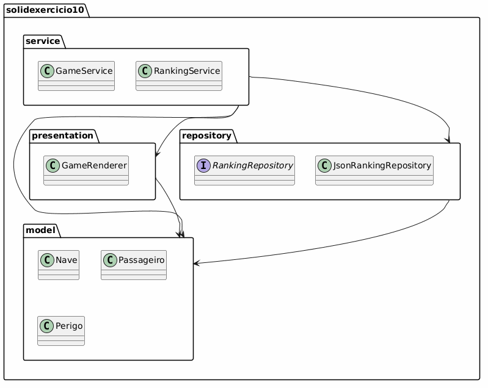

# Missão Marte Unifor — Refatoração SOLID

**Aluna:** Maria Rafaele Gomes de Araújo — Matrícula 2618240
**Disciplina:** Projeto e Arquitetura de Sistemas — UNIFOR

Refatoração do Exercício 10 (`src/exercicio10`), aplicando os princípios SOLID em um pacote separado (`src/solidexercicio10`), conforme o tutorial em [`src/README.md`](src/README.md) do repositório base do professor.

## Estrutura do projeto

```text
src/
  exercicio10/          # código original preservado, para comparação
  solidexercicio10/      # versão refatorada
    Main.java            # ponto de entrada e composição das dependências
    model/                # entidades e regras do domínio (Nave, Passageiro, Missao, Asteroide, Inimigo, Dificuldade, Posicionavel, Movel, Perigo, ...)
    presentation/          # GameRenderer: desenha o mapa e as informações da partida
    service/               # GameService (fluxo/regras da partida) e RankingService (regras de ranking)
    repository/            # RankingRepository (contrato), JsonRankingRepository (implementação em JSON), RankingEntry
docs/uml/                 # diagramas de classes e de pacotes (.puml + .png)
REVISAO-SOLID.md          # revisão crítica da refatoração
```

## Como compilar

Original (Exercício 10):

```bash
javac -d bin src/exercicio10/*.java
```

Versão refatorada (SOLID):

```bash
javac -d bin $(find src/solidexercicio10 -name "*.java")
```

No Windows (PowerShell), como alternativa ao `find`:

```powershell
javac -d bin (Get-ChildItem -Recurse -Filter *.java src/solidexercicio10).FullName
```

## Como executar

Original:

```bash
java -cp bin Main
```

Refatorada:

```bash
java -cp bin solidexercicio10.Main
```

O ranking é salvo em `ranking.json`, criado na pasta a partir de onde o jogo é executado.

## O que foi alterado nesta correção pós-entrega

A versão entregue não compilava/rodava por dois motivos, corrigidos agora:

1. **Estrutura de pastas incorreta:** as classes refatoradas declaravam `package solidexercicio10...`, mas estavam fisicamente soltas em `src/`, `src/service/` e `src/repository/`, fora de uma pasta `src/solidexercicio10/`. Isso impedia a compilação pelo comando documentado. Os arquivos foram movidos para `src/solidexercicio10/{model,presentation,service,repository}`, mantendo os nomes de classe originais (`GameService`, `GameRenderer`, `JsonRankingRepository`, etc.).
2. **Dois `Scanner` sobre o mesmo `System.in`:** `Main` criava um `Scanner` para o menu e outro (`new Scanner(System.in)`) dentro do método que inicia a partida, passado ao `GameService`. O segundo `Scanner` ficava sem dados para ler (o primeiro já havia consumido o buffer do fluxo), e o jogo travava com `NoSuchElementException` assim que a partida começava. Corrigido reaproveitando um único `Scanner` durante toda a execução.

Ambos os problemas foram verificados e corrigidos localmente (compilação limpa + execução completa do menu, movimentação, embarque, ranking e reset). Detalhes em [`REVISAO-SOLID.md`](REVISAO-SOLID.md#correção-pós-entrega-29092026).

## Decisões de projeto

- Pacotes `model`, `service`, `presentation` e `repository`, seguindo a organização sugerida no tutorial do professor, mas com nomes de classe próprios (`GameService`, `GameRenderer`, `JsonRankingRepository`) em vez dos nomes de referência (`JogoService`, `MapaRenderer`, `RankingService` como implementação).
- `RankingService` foi mantido como uma camada de serviço sobre `RankingRepository` (não como a implementação concreta de persistência, como no tutorial), para deixar mais explícito que `JsonRankingRepository` é quem sabe que o formato de armazenamento é JSON.
- Interfaces pequenas (`Posicionavel`, `Movel`, `Perigo`) em vez de uma única interface genérica, para respeitar ISP.
- `GameService`/`RankingService` dependem da abstração `RankingRepository`, nunca de `JsonRankingRepository` diretamente (DIP).

Justificativas completas por princípio SOLID estão em [`REVISAO-SOLID.md`](REVISAO-SOLID.md).

## Limitações conhecidas

- Persistência apenas em arquivo JSON local (sem banco de dados); ver observação em `REVISAO-SOLID.md`.
- `GameRenderer` escreve diretamente no console (`System.out`), sem uma interface `Renderer` que permitisse trocar por uma UI gráfica no futuro.
- Sem testes automatizados; a validação foi feita manualmente (ver checklist em `REVISAO-SOLID.md`).

## Diagramas UML

Em [`docs/uml/`](docs/uml/):

- **[`diagrama-classes-model.puml`](docs/uml/diagrama-classes-model.puml) / [`.png`](docs/uml/diagrama-classes-model.png)** — classes do domínio: `Nave`, `Passageiro` e subclasses (`Professor`, `Engenheiro`, `Astronauta`), `Asteroide`, `Inimigo`, `Missao`, `Dificuldade`, `Posicionavel`, `Movel`, `Perigo`, com heranças, interfaces e composições (`Missao` agrega `Nave`, `Passageiro` e `Perigo`).
- **[`diagrama-pacotes.puml`](docs/uml/diagrama-pacotes.puml) / [`.png`](docs/uml/diagrama-pacotes.png)** — estrutura das entidades do projeto.




